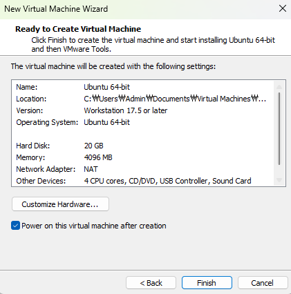

# TCP-IP-2025
TCP-IP 공부

## 1일차 

### 가상환경 설치 및 환경변수 설정 

1. [VMWARE](https://www.vmware.com/products/desktop-hypervisor/workstation-and-fusion)
2. [ubntu](https://ubuntu.com/)
3. [Putty](https://www.chiark.greenend.org.uk/~sgtatham/putty/latest.html)

#### 소켓통신 
- 인터넷(이더넷)통신이 일반적인 소켓통신이다
- 일반적으로는 TCP방식이 메시지를 주고받는 방식이다

#### 클라이언트(client)
- 일방적으로 정보를 달라고하는 쪽
- 클라이언트는 서버에게 요청을 보내고, 서버는 요청을 처리한 후 응답을 클라이언트에 반환

#### 서버(server)
- 정보를 주는쪽
- 클라이언트에게 네트워크를 통해 정보나 서비스를 제공하는 컴퓨터 시스템 또는 프로그램을 의미

#### VMWARE
- 클라우드 컴퓨팅 및 가상화 소프트웨어 이다 
- 윈도우에서 가상환경을 구축해서 다른 OS를 사용하게하는 것

#### ip
- 컴퓨터의 주소 
- 인터넷 프로토콜(Internet Protocol)의 약자로, 인터넷이 통하는 네트워크에서 어떤 정보를 수신하고 송신하는 통신에 대한 규약을 의미함

#### 포트(Port) 
- 실행되는 프로그램의 최종목적지의 주소, 프로그램을 구분하는 용도 
- 컴퓨터가 각종 신호를 받아들이고 내보낼 수 있도록 연결할 수 있는 연결단자를 말한다. 컴퓨터 케이스에 달려 있어 손쉽게 연결이 가능한 외부 포트와, 컴퓨터 내부에 설치되어 있어 케이스를 열지 않으면 접근할 수 없는 내부 포트가 있다

#### TCP-IP 소켓통신 과정       클라이언트통신 과정
1. 소켓생성 : socket()              socket
2. 소켓주소 할당 : bind()
3. 연결요청 대기 : listen()         connetc
4. 연결허용 : accept()
5. 데이터 송신 : read/write()       read/write
6. 종료 : close()                   close

#### VMware Workstation
- 실행 > Create a New Virual Machine > 우분투설치 폴터 지정설치 > 코어와 메모리는 기본으로 넘기기 > 싱글 파일로 설정 >

    

#### Ubuntu 명령어
- uname -a : 정보확인
- cd : 폴더 이동
- ls : 현재폴더를 보여준다 
- pwd : 현재위치
- cd .. : 전단계로 이동 
- mkdir : 폴더 생성
- clear : 화면지움 
- rm -fr : 파일 폴더 삭제
- sudo nano /etc/nanorc : nano설정
- touth : 빈파일 생성
- cat : 안에 들어있는 내용 확인
- cp : 복사 
- mv : 파일옮기기
- ./ : 현재 폴더
- ../ : 현재 폴더의 상위폴더로 
- sudo apt install gcc : gcc컴파일러 설치
- ./xxx : 실행명령

#### c언어 함수? 명령어? 부분

- 에러 메시지 : perror("message")

-  fd = open ("hello.txt", O_CREAT | O_WRONLY : ); 
    - fd 파일을 열어라 hello.txt가 없다면 만들고 읽어라 

- write : 오픈한 파일에 데이터를 쓸 때 사용하는 시스템 호출 

- size_t == unsigned int 정수 자료형 
- ssize_t == signed int  장수 자료형
- off_t == long형 정수
- htonl : 호스트 형태의 바이트(데이터) 순서를 네트워크로 형태로 바꿔라 
    - htonl 함수는 호스트 바이트 순서(보통 리틀 엔디안)의 32비트 정수를 네트워크 바이트 순서(빅 엔디안)의 32비트 정수로 변환하는 역할을 합니다. 이는 네트워크 프로그래밍에서 시스템 간의 데이터 호환성을 유지하기 위해 필수적인 작업
    - long intger(일반적으로 4byte) 데이터를 네트워크 byte order로 변경
- htons : 호스트 형태의 바이트 순서를 네트워크로 형태로 바꿔라 
    - short intger(일반적으로 2byte) 데이터를 네트워크 byte order로 변경

1. 빅 엔디안(big endian)
    - 빅 엔디안 방식은 낮은 주소에 데이터의 높은 바이트(MSB, Most Significant Bit)부터 저장하는 방식입니다.
2. 리틀 엔디안(little endian)
    - 리틀 엔디안 방식은 낮은 주소에 데이터의 낮은 바이트(LSB, Least Significant Bit)부터 저장하는 방식입니다.
     unsigned short htons(unsigned short);	h → n (short)
     unsigned short ntohs(unsigned short);	n → h (ushort)
     unsigned long htonl(unsingned long);	n → n (ulong) 
     unsigned long ntohl(unsigned long);	n → h (ulong)

#### IPv4 인터넷 주소의 체계
클래스 A        네트워크ID(1바이트) + 호스트ID(3바이트)         0 ~ 127 이하(0)
클래스 B        네트워크ID(2바이트) + 호스트ID(2바이트)         129 ~ 191(10)
클래스 C        네트워크ID(3바이트) + 호스트ID(1바이트)         192 ~ 223(110)
클래스 D        

#### 프로토콜 체계
PF_INET         IPv4 인터넷 프로토콜 체계
PF_INET6        IPv6 인터넷 프로토콜 체계

#### 소켓의 타입 (전송방식)
TCP(연결지향형 소켓) - SOCK_STREAM
UDP(비연결지향형 소켓) - SOCK_DGRAM

## 2일차 

#### c언어 함수 
- inet_addr() : 문자열로 되어있는 주소값을 정수값으로 바꿀수있다 

- 서버 함수
    socket( )				    소켓생성						전화기 구입
    
    bind( )					    소켓 주소할당				    전화번호 할당
    
    listen( )					연결요청 대기				    개통
    
    accept( )				    연결허용			    	    전화 받기	

    read( )/write( )		    데이터 송수신			        통화

    close( )					연결종료						통화 종료

- 클라이언트 함수 
   socket( )				    소켓생성						전화기 구입

   connect( )					연결요청				         전화 걸기

   read( )/write( )		    데이터 송수신				            통화

   close( )					    연결종료						  통화 종료
    

#### 리눅스 Tip (커멘드)
- 복사 : ctrl + insert or ctrl + shift + C 
- 붙여넣기: shift + insert 

## 3일차 
- 구조체 함수 
    sin_family     	주소체계(Address Family) 	: IPv4, IPv6
    sin_addr	   	32bit IP주소 정보 저장		: xxx.xxx.xxx.xxx
    sin_port 	   	16bit PORT번호 저장			: 0 ~ 65525

    htonl            	host 주소 -> network주소 변환(unsigned long)
    ntohl			network 주소 -> host 주소 (unsigned long)
    INADDR_ANY	현재 실행중인 컴퓨터의 IP를 소켓에 부여.
    
16 번 부터 보기--------------------------------------------------------

- fork를 사용하여 멀티프로세스를 사용 
- 제대로 처리해주지 않으면 프로세스를 잡아먹는 좀비 프로세스가 됨

- 좀비프로세스 배움 

## 4일차 
- ppt 35 ~ 

- 멀티프로세서 
    - 시그널이란 운영체제가 어떤 특정한 상황을 프로세서에게 알리는 것으로 자식프로세서의 종료를 운영체제로 부터 전달받는다 
    - fork를 사용해서 멀티프로세스를 사용 (어제한거) 

- 함수 포인터 ppt-36
    - 함수 호출이 되면 함수를 찾아가야하는데 이를 찾을때는 함수의 이름(함수포인터)을 찾는다
    - 함수를 저장할때도 (함수)포인터를 사용한다 
    
- 시그널 and 시그널 액션  ppt-37
    - wait를 사용하거나 시그널 또는 시그액션을 사용 
    - 시그액션을 많이사용하는 편이다 

- 멀티 프로세
    - 모든 프로세서는 자신만의 메모리 공간을 확보하여 사용한다.
    - 따라서 프로세서간 데이터 전달은 불가능하다.
        → 운영체제가 별도의 메모리공간(pipe)을 마련하여 프로세서간 통신을 지원한다.
    
    - 멀티프로세서의 단점
    - 프로세서의 빈번한 생성으로 성능저하가 발생하고
    - 멀티 프로세서의 흐름 구현이 쉽지 않다.
    - 또한 프로세서간 통신이 필요한 경우는 구현이 더 복잡 해진다

- 멀티 플레싱 ppt-39 (selet.c)
    - 멀티 프로세서의 단점을 보안
    
    하나의 프로세서로 다수의 클라이언트에게 서비스를 제공한다. 
    그러면 하나의 프로세서가 여러 개의 소켓을 핸들링해야 한다.
    이것이 IO 멀티 플렉싱이다.
    (하나의 프로세서가 서버 소켓 + 여러 클라이언트 소켓을 관리)
    
    select함수는 다웃의 파일 디스크립트 등록하여 읽기/쓰기/오류에 대한 이벤트 발생 여부를 관찰한다.